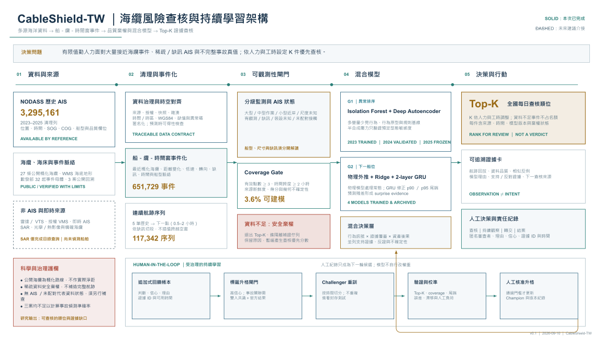
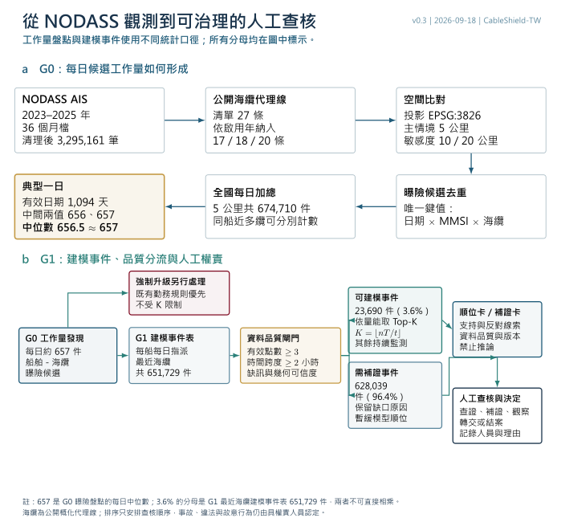
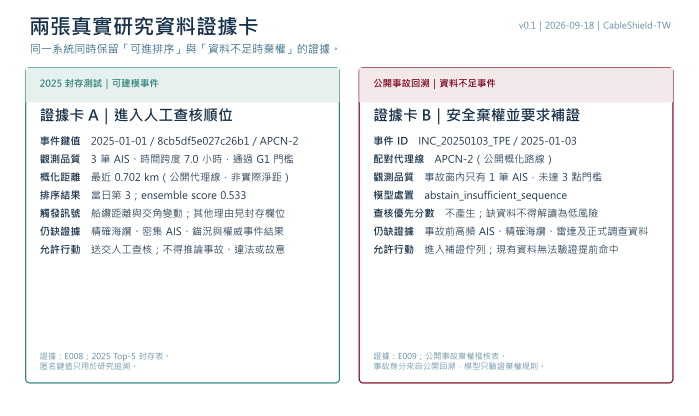

# CableShield-TW｜既有監控之後的證據化查核層
更新：2026-09-18 · v0.7.2

CableShield-TW 以既有 SAWS、AIS、VTS 與跨機關流程為輸入基礎，採只讀方式整理候選、資料品質、模型分歧與查核理由。AI 提供優先序和證據提示；查核、定性、處置與權責保留在正式人員及機關流程。

評審可用四個問題理解本案：

1. 候選是否超過深查量能？G0 研究盤點的每日中位數為 656.5 筆，約 657 筆。
2. 資料是否足以解讀？G1 將 23,690 筆送入模型表，628,039 筆列為需補證。
3. 為何先查這些？系統呈現規則、多模型訊號、分歧、反證與資料缺口。
4. 最後由誰負責？正式人員完成查核、定性與處置，系統保留操作理由。

## 資料處理與模型架構

本團隊先以 G0 曝險盤點量化工作量：5 公里情境共 674,710 件，1,094 個有效日期的每日中位數為 656.5，約 657 件。G1 再將每個船舶日指派給最近海纜，共 651,729 件；23,690 件（占 G1 的 3.6%）通過 Coverage Gate，628,039 件（96.4%）保留原因並進入補證佇列。G0 與 G1 的分母不同，657 與 3.6% 不直接相乘。

通過閘門的事件由 G1 異常排序及 G2 下一船位模型提供證據。系統依人力與工時設定 K，產出 Top-K 查核順位；競賽示例採 K=5。人工回饋經標籤升格、時序驗證與核准後，才可更新下一版模型。

G0、G1 與 Top-K 回答不同問題：657 是 G0 研究工作量；3.6% 是 G1 模型資格率；K 是人工深查預算。三者使用不同分母與功能，不能把 657→K 寫成模型已辨認出每日只有 K 件具風險。

[下載向量 PDF](./assets/cableshield-architecture-v0.1.pdf) · [另頁開啟 SVG](./assets/cableshield-architecture-v0.1.svg)

可編輯母檔（diagrams.net）：
[系統架構](./assets/editable/cableshield_architecture_zh_20260910.drawio) ·
[G0→G1→Top-K 流程](./assets/editable/cableshield_daily_candidate_flow_v0.3.drawio) ·
[研究資料證據卡](./assets/editable/cableshield_real_evidence_cards_v0.1.drawio) ·
[Step 4 替代方案排除](./assets/editable/cableshield_step4_alternative_elimination_v0.2.drawio) ·
[Step 5 研究結論](./assets/editable/cableshield_step5_research_conclusion_v0.2.drawio)

以船舶或匿名接觸事件為單位，依尺寸證據、作業型態及可觀測性調整查核方式。船型不能代替尺寸證據；未取得船長或噸位時保留未知。

| 對象 | 查核策略 |
|---|---|
| 大型船 | 核對 AIS、接收覆蓋及跨來源一致性 |
| 中型作業船 | 加入正常漁業、工程作業與環境解釋 |
| 小型近岸船 | 優先考慮岸際連續觀測；免費 SAR 未見目標不代表沒有船 |
| 尺度／身分未知 | 保留匿名接觸紀錄，先確認目標與配對證據 |

AIS 分為有觀測、曾有但缺訊、未取得／裝設未知、其他感測器偵測但未配對。缺訊本身不構成惡意或違法證據。

已完成：歷史 AIS 預覽、四模型訓練與封存證據、三案回溯棄權、人機回饋契約及互動策略預覽。
SAR 已完成影像目錄查詢；影像船舶偵測、雷達、VMS與光學／熱影像均待驗證或介接。策略選項不代表即時觀測。

研究驗證：依尺寸已知／未知、AIS狀態與資料品質分層報告覆蓋、棄權及查核量；取得獨立真值後才報告非AIS偵測效能。人工標籤需經共識與封存驗證後才用於更新模型。

導入建議採三階段：本屆完成離線研究原型；取得授權後才進行只讀影子模式，量測省時、Recall@K、人工覆寫率與補證完成率；通過驗證後，再由主管機關決定是否有限介接。影子模式與正式串接均屬未來建議，未列為本屆已完成成果。

## 研究結論與後續驗證

臺灣現有 AIS、VTS、SAWS 及跨機關機制，已提供監測、告警、通報與應變基礎。本研究聚焦候選形成後的資料可判性、查核順序、證據缺口與人工覆核流程。現階段結果支持資料流程與研究原型的可重現性；實際省時、Recall@K、人工負荷與整合效益仍需在取得授權後，以只讀影子模式驗證。

來源與設計依據：
- [ESA 船舶偵測](https://knowledge-hub-gda.esa.int/eo_capability/ship-detection/)
- [Copernicus 資料時效](https://documentation.dataspace.copernicus.eu/FAQ.html)
- [數發部海纜報告](https://moda.gov.tw/press/press-releases/19392)
