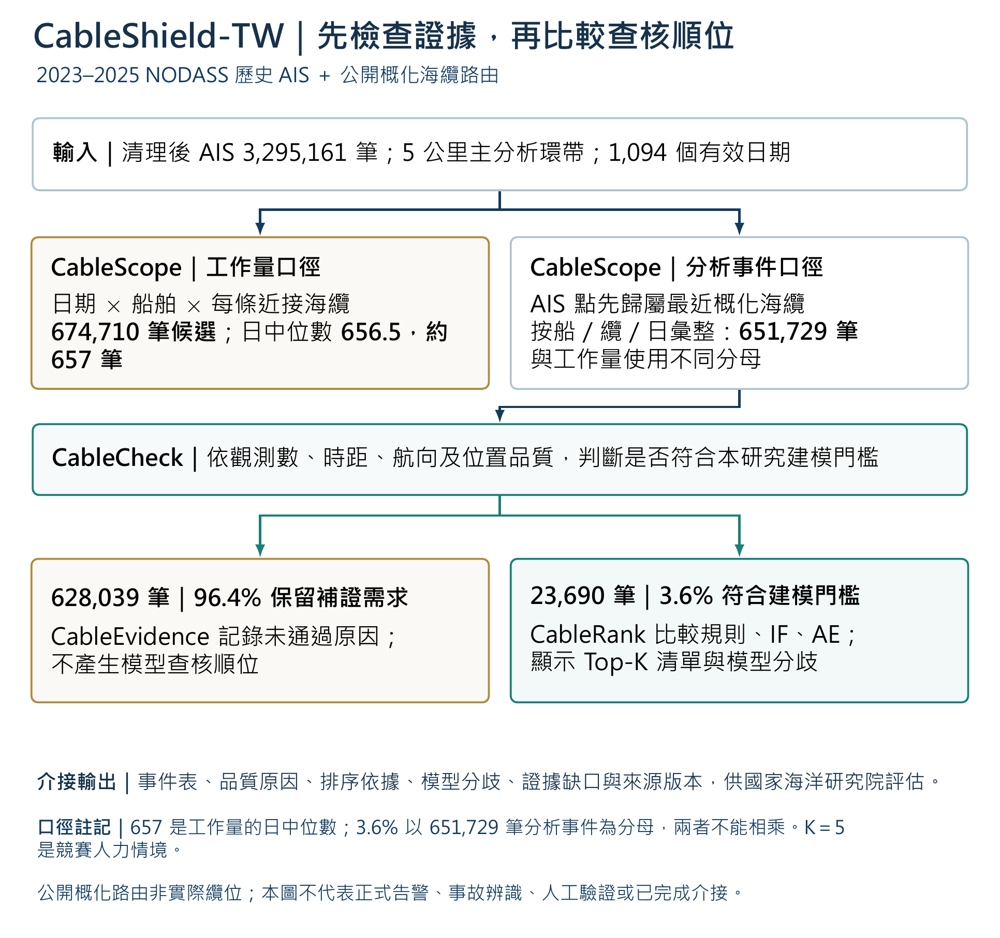
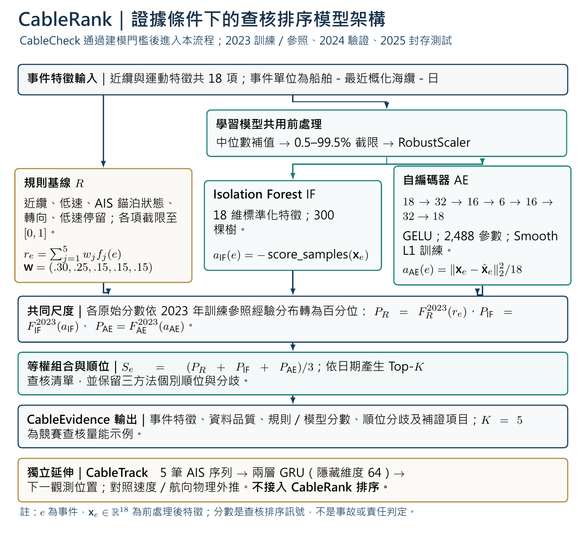

# CableShield-TW｜海纜近接事件資料可判性與查核排序系統
更新：2026-09-23 · 研究定位 v1.0

**英文題名：** CableShield-TW: Evidence Readiness and Triage for Subsea Cable Encounters

現行防護已有 AIS 監測、近纜與低速停留預警、AI 異常篩選及跨機關應變。本研究以 NODASS 2023–2025 年**歷史 AIS**及公開概化海纜路由，研究大量近接紀錄形成後，資料能否支持分析、哪些事件值得優先查核，以及尚缺哪些證據。公開資料不足以判定現行系統內部是否已有相同品質分流或排序功能，因此本研究只比較公開功能與本團隊可重現的成果。

[下載向量 PDF](./assets/cableshield_evidence_readiness_flow_v0.9.pdf) · [下載可編輯 LaTeX 圖檔](./assets/editable/cableshield_evidence_readiness_flow_v0.9.tex)

### CableRank 模型架構

[下載模型架構圖 PDF](./assets/cableshield_model_architecture_v1.0.pdf) · [下載可編輯 LaTeX 原始檔](./assets/editable/cableshield_model_architecture_v1.0.tex)

| 研究口徑 | 結果 | 意義 |
|---|---:|---|
| CableScope 候選工作量 | 1,094 個有效日期、674,710 筆船舶－海纜－日候選；日中位數 656.5，約 657 筆 | 衡量近纜候選工作量 |
| CableScope 最近海纜分析事件 | 651,729 筆 | 每個 AIS 點先歸屬最近概化海纜，再按日期、船舶與海纜彙整；與候選工作量不同分母 |
| CableCheck 符合本研究建模門檻 | 23,690 筆，3.6% | 可進行規則與模型順位比較 |
| CableCheck 保留補證需求 | 628,039 筆，96.4% | 保留未通過原因，不輸出模型查核順位 |

**657 與 3.6% 不能相乘。**兩者來自不同統計口徑。3.6% 是原模型品質門檻下的納入比例，不是海域事件「可判定真相」的比例。

### CableCheck 門檻敏感度

原門檻為同一事件至少3筆觀測、首末跨度至少2小時、有效對地航向（COG）比例至少50%、最大觀測間隔不超過6小時、位置跳躍旗標比例不超過20%。3筆避免只憑單次相鄰變化描述事件；6小時與運動特徵的有效步驟上限一致。其餘數值為研究設定，未宣稱最適。

下表固定首末跨度、COG與跳躍門檻，以及5公里事件母體，交叉改變觀測數與最大間隔。每格列出條件通過數及占651,729筆事件的比例；粗體為原模型納入設定。

| 最少觀測數 | 最大間隔≤3小時 | ≤6小時 | ≤12小時 |
|---|---:|---:|---:|
| 2筆 | 31,713（4.9%） | 48,888（7.5%） | 64,634（9.9%） |
| 3筆 | 15,652（2.4%） | **23,690（3.6%）** | 31,045（4.8%） |
| 4筆 | 6,370（1.0%） | 11,432（1.8%） | 15,885（2.4%） |

其餘三項逐一調整時，首末跨度1／2／4小時的通過率為3.6／3.6／2.5%，COG覆蓋25／50／75%均為3.6%，跳躍比例上限0／20／40%均約3.6%。這是單因子重算，不能證明哪個數值最適。

547,490筆（84.0%）5公里事件只有一個AIS點，無法重建該事件內的時序變化。單點可由短暫近接、資料取樣或事件切分形成，不能直接認定來源缺訊。替代門檻只重算條件通過數，未依新設定重建特徵或重訓模型；**3.6%會變，但單點事件占多數的事實不因門檻設定而改變。**

CableRank 比較透明規則、Isolation Forest 與自編碼器。2024 與 2025 年兩個學習模型的順位 Spearman 相關分別為 0.820、0.814；2024 年每日 Top-5 平均 Jaccard 為 0.522。整體排序相近，有限查核清單仍有分歧，故證據卡應呈現各方法依據與分歧，交由接收單位決定使用方式。半合成測試中規則基線表現較佳，僅支持對預設擾動的敏感性，不能推論真實事故辨識率。K=5 是競賽人力情境，未經值勤單位確認。

CableEvidence 輸出事件、品質原因、排序依據、模型分歧、證據缺口及來源版本，供國家海洋研究院評估如何接入既有系統。CableTrack 是獨立的近纜船舶航跡預測延伸分析；GRU 在兩年尾端誤差較低、中位誤差較高，不參與 CableRank 排序。

本屆完成離線歷史分析、模型比較、公開展示與本機功能測試；**未執行人工使用者驗證、未以人工回饋重訓，也未完成院方正式介接**。本機有可保存回饋的程式契約，但不列入本屆主流程與成效。公開展示的觀測及航跡已匿名、概化，模擬模式為合成資料；概化路由不是實際纜位，分數不代表事故、惡意或責任。

來源：[數位發展部現行海纜防護說明](https://web.moda.gov.tw/press/press-releases/20658) · [數位發展部海纜損害報告](https://moda.gov.tw/major-policies/subseacable/report/1805)。完整來源與限制請見複賽報告書。
